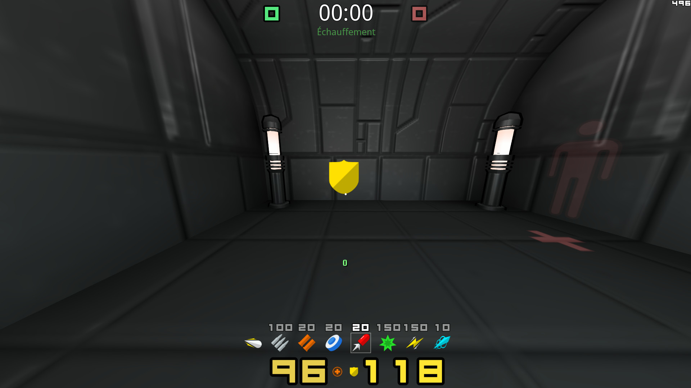

# Items

| Items                         | Description                             |
|-------------------------------|-----------------------------------------|
| [Health items](#health-items) | Items that increases the players health |
| [Armor items](#armor-items)   | Items that increases the players armor  |
| [Damage items](#damage-items) | Items that increases the players damage |

## Health items

| Name                                        | Description                                        |
|---------------------------------------------|----------------------------------------------------|
| [Health vials](#health-vials)               | restores 5 health up to 100hp                      |
| [Health bubble (25hp)](#health-bubble-25hp) | restores 25 health up to 100hp                     |
| [Health bubble (50hp)](#health-bubble-50hp) | restores 50 health up to 100hp                     |
| [Mega Health](#mega-health)                 | restores 100 health which can overheal up to 200hp |

### Health vials

### Health bubble (25hp)

### Health bubble (50hp)

### Mega health

## Armor items

| Name                          | Description                             |
|-------------------------------|-----------------------------------------|
| [Armor Shards](#armor-shards) | increases armor by 5 up to 200 armor    |
| [Green Armor](#green-armor)   | increases armor by 50 up to 100 armor   |
| [Yellow Armor](#yellow-armor) | increases armor by 75 up to 125 armor   |
| [Red Armor](#red-armor)       | increases armor by 100  up to 150 armor |

### Armor Shards

### Green Armor

### Yellow Armor

### Red Armor

## Damage items

### Weapon Item

### Ammo Item

### Quad damage

