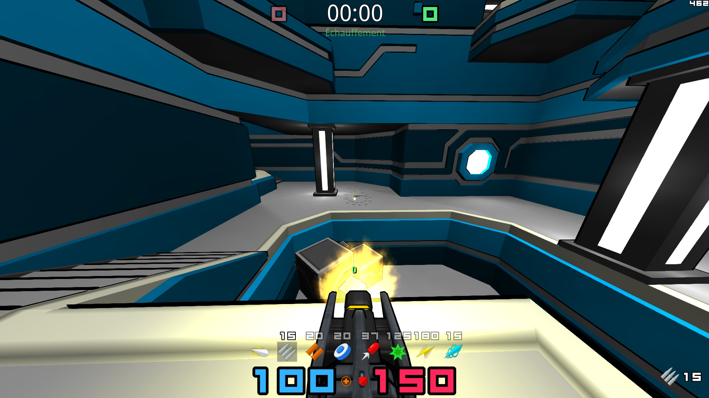

# Weapons

| Weapon                                | Abbr | Description                                                                                                            |
|---------------------------------------|------|------------------------------------------------------------------------------------------------------------------------|
| [Gunblade](#gunblade)                 | GB   | A melee weapon that can also fire projectiles if it is upgraded                                                        |
| [Machinegun](#machinegun)             | MG   | A weapon that fires bullets at a regular interval                                                                      |
| [Riotgun](#riotgun)                   | RG   | A shotgun that fires a spread of bullets that each deal damage                                                         |
| [Grenade Launcher](#grenade-launcher) | GL   | Launches grenade like projectiles dealing that persist until they hit an enemy or explode after a fixed amount of time |
| [Rocket Launcher](#rocket-launcher)   | RL   | Launches rockets in a straight line until they hit a player or terrain                                                 |
| [Plasma Gun](#plasma-gun)             | PG   | Launches plasma projectiles at a fixed interval                                                                        |
| [Laser Gun](#laser-gun)               | LG   | Emits a fixed distance laser beam damaging the first encountered enemy                                                 |
| [Electrobolt](#electrobolt)           | EB   | Sniper rifle that emits a ray of light damaging the first enemy hit.                                                   |
| [Instabeam](#instabeam)               | IB   | Similar to the Electrobolt but it will one hit kill the enemy. This weapon is only available in Instagib gamemode.     |

##  Gunblade

#### Description

The gunblade is a melee weapon that can also fire projectiles if you hold the upgraded version. When in close combat against an enemy player the gunblade will automatically spin and deal damage to the opponent. When fired the upgraded gunblade launches a small projectile dealing AOE damage in a small area.

#### Strategy

- The melee damage from the gunblade can be useful to finish off an enemy that is low and is in close range as you will have a harder time hitting them consistently with the other weapons.
- The AOE damage from the upgraded gunblade inflicts self-damage so you can use it to increase your speed or perform a rocket jump.

#### Game variables

| Description          | Value                  |
|----------------------|------------------------|
| Ammo/shot            | 1                      |
| Projectile/shot      | 1                      |
| <b>Timing (ms)</b>   | ---------------------- |
| Weapon Up            | 50                     |
| Weapon Down          | 50                     |
| Reload               | 600                    |
| Cooldown             | 0                      |
| Projectile Timeout   | 5000                   |
| Smooth Refire        | false                  |
| <b>Damages</b>       | ---------------------- |
| Damage               | 35                     |
| Self damage ratio    | 1                      |
| Knockback            | 90                     |
| Stun                 | 0                      |
| Splash radius        | 70                     |
| Splash min damage    | 8                      |
| Splash min knockback | 10                     |
| <b>Projectile</b>    | ---------------------- |
| speed                | 3000                   |
| spread               | 0                      |
| v_spread             | 0                      |
| <b>Ammo</b>          | ---------------------- |
| Weapon pickup amount | 0                      |
| Pickup amount        | 0                      |
| Max amount           | 1                      |
| Low threshold        | 0                      |

##  Machinegun

#### Description
The machine gun is weapon that fires damaging bullets at a regular interval.

#### Strategy

- The bullet travel instantaneously so the machine gun can be used to snipe low enemies.
- Each bullet will stun the enemies so you can use the machine gun to reduce the speed of an incoming enemy.

#### Game variables

| Description          | Value                  |
|----------------------|------------------------|
| Ammo/shot            | 1                      |
| Projectile/shot      | 1                      |
| <b>Timing (ms)</b>   | ---------------------- |
| Weapon Up            | 50                     |
| Weapon Down          | 50                     |
| Reload               | 100                    |
| Cooldown             | 0                      |
| Projectile Timeout   | 6000                   |
| Smooth Refire        | false                  |
| <b>Damages</b>       | ---------------------- |
| Damage               | 10                     |
| Self damage ratio    | 0                      |
| Knockback            | 10                     |
| Stun                 | 50                     |
| Splash radius        | 0                      |
| Splash min damage    | 0                      |
| Splash min knockback | 0                      |
| <b>Projectile</b>    | ---------------------- |
| speed                | INSTANT                |
| spread               | 10                     |
| v_spread             | 10                     |
| <b>Ammo</b>          | ---------------------- |
| Weapon pickup amount | 50                     |
| Pickup amount        | 50                     |
| Max amount           | 100                    |
| Low threshold        | 20                     |

##  Riotgun

#### Description

The Riotgun is a shotgun like weapon that fires a burst of bullets. The spread of each shot is fixed, making it the ideal weapon for close combat as you will be able to land more bullets.

#### Strategy

- You can wait at the exit of teleporters with the riot gun, bursting the outgoing enemy.
- The riotgun can be used to finish low enemies as you will, at least land part of the bullet spread.

#### Game variables

| Description          | Value                  |
|----------------------|------------------------|
| Ammo/shot            | 1                      |
| Projectile/shot      | 20                     |
| <b>Timing (ms)</b>   | ---------------------- |
| Weapon Up            | 50                     |
| Weapon Down          | 50                     |
| Reload               | 900                    |
| Cooldown             | 0                      |
| Projectile Timeout   | 8192                   |
| Smooth Refire        | false                  |
| <b>Damages</b>       | ---------------------- |
| Damage               | 5                      |
| Self damage ratio    | 0                      |
| Knockback            | 7                      |
| Stun                 | 85                     |
| Splash radius        | 0                      |
| Splash min damage    | 0                      |
| Splash min knockback | 0                      |
| <b>Projectile</b>    | ---------------------- |
| speed                | INSTANT                |
| spread               | 160                    |
| v_spread             | 90                     |
| <b>Ammo</b>          | ---------------------- |
| Weapon pickup amount | 10                     |
| Pickup amount        | 10                     |
| Max amount           | 20                     |
| Low threshold        | 3                      |

##  Grenade Launcher

#### Description

The grenade launcher is a projectile weapon that fires explosive grenades. It's a powerful weapon that can deal significant damage to both enemies and the environment. The grenades are affected by gravity, which means players need to adjust their aim to compensate for the arc of the grenade's flight. The grenades bounce off walls and other surfaces before detonating. This allows skilled players to use the grenades to hit enemies around corners or behind cover. 

#### Strategy

- The grenades have a small blast radius, so players need to aim accurately to hit their target.
- The grenade launcher has a slow rate of fire, which means players need to carefully time their shots.
- The grenade launcher can also be used to rocket jump, which involves firing a grenade at the ground beneath the player's feet to propel themselves into the air.
- It can be risky to use in close-quarters combat, as the grenades can cause self-damage

#### Game variables

| Description          | Value                  |
|----------------------|------------------------|
| Ammo/shot            | 1                      |
| Projectile/shot      | 1                      |
| <b>Timing (ms)</b>   | ---------------------- |
| Weapon Up            | 50                     |
| Weapon Down          | 50                     |
| Reload               | 800                    |
| Cooldown             | 0                      |
| Projectile Timeout   | 1250                   |
| Smooth Refire        | false                  |
| <b>Damages</b>       | ---------------------- |
| Damage               | 80                     |
| Self damage ratio    | 1                      |
| Knockback            | 100                    |
| Stun                 | 1250                   |
| Splash radius        | 125                    |
| Splash min damage    | 15                     |
| Splash min knockback | 35                     |
| <b>Projectile</b>    | ---------------------- |
| speed                | 1000                   |
| spread               | 0                      |
| v_spread             | 0                      |
| <b>Ammo</b>          | ---------------------- |
| Weapon pickup amount | 10                     |
| Pickup amount        | 10                     |
| Max amount           | 20                     |
| Low threshold        | 3                      |

##  Rocket Launcher

#### Description

The rocket launcher is a powerful projectile weapon that fires explosive rockets. The rockets travel quickly through the air and have a large blast radius and can deal significant damage to enemies. The damage dealt will decreased with the distance of the enemy to the rocket's explosion, dealing a minimum of damage after a certain range.

#### Strategy

- The rocket launcher has a moderate rate of fire, which means players need to carefully time their shots.
- You can shoot at the feet of your opponents to launch them into the air, making them easier to hit with other weapons like the [electrobolt](#electrobol).
- The rocket launcher can also be used to rocket jump, which involves firing a rocket at the ground beneath the player's feet to propel themselves into the air.
- It can be risky to use in close-quarters combat, as the rockets can cause self-damage

#### Game variables

| Description          | Value                  |
|----------------------|------------------------|
| Ammo/shot            | 1                      |
| Projectile/shot      | 1                      |
| <b>Timing (ms)</b>   | ---------------------- |
| Weapon Up            | 50                     |
| Weapon Down          | 50                     |
| Reload               | 950                    |
| Cooldown             | 0                      |
| Projectile Timeout   | 10000                  |
| Smooth Refire        | false                  |
| <b>Damages</b>       | ---------------------- |
| Damage               | 80                     |
| Self damage ratio    | 1                      |
| Knockback            | 100                    |
| Stun                 | 1250                   |
| Splash radius        | 125                    |
| Splash min damage    | 15                     |
| Splash min knockback | 35                     |
| <b>Projectile</b>    | ---------------------- |
| speed                | 1150                   |
| spread               | 0                      |
| v_spread             | 0                      |
| <b>Ammo</b>          | ---------------------- |
| Weapon pickup amount | 5                      |
| Pickup amount        | 10                     |
| Max amount           | 20                     |
| Low threshold        | 3                      |

##  Plasma Gun

#### Description

The plasma gun is a rapid-fire weapon that fires streams of plasma energy. Each plasma bullet acts as a projectile and has a small blast radius that will inflict the damage to the enemies.

#### Strategy

- Aim at the feet of you enemies as the blast deals as much damage as the bullet.
- Spam chokepoints to prevent enemies from reaching a specific area as they will have to go through the stream of plasma to reach you.

#### Game variables

| Description          | Value                  |
|----------------------|------------------------|
| Ammo/shot            | 1                      |
| Projectile/shot      | 1                      |
| <b>Timing (ms)</b>   | ---------------------- |
| Weapon Up            | 50                     |
| Weapon Down          | 50                     |
| Reload               | 100                    |
| Cooldown             | 0                      |
| Projectile Timeout   | 5000                   |
| Smooth Refire        | false                  |
| <b>Damages</b>       | ---------------------- |
| Damage               | 15                     |
| Self damage ratio    | 0.5                    |
| Knockback            | 20                     |
| Stun                 | 200                    |
| Splash radius        | 45                     |
| Splash min damage    | 5                      |
| Splash min knockback | 1                      |
| <b>Projectile</b>    | ---------------------- |
| speed                | 2500                   |
| spread               | 0                      |
| v_spread             | 0                      |
| <b>Ammo</b>          | ---------------------- |
| Weapon pickup amount | 50                     |
| Pickup amount        | 100                    |
| Max amount           | 150                    |
| Low threshold        | 20                     |

##  Laser Gun

#### Description

The laser gun is a futuristic energy weapon that fires a continuous beam of energy. It's a powerful and versatile weapon that can be used for both offensive and defensive purposes. The weapons fires a continuous beam of energy that deals continuous damage to enemies as long as it's hitting them. However the beam has a limited range and can only travel a short distance before dissipating. This means players need to be close to their targets to use the laser gun effectively.

#### Strategy
- The laser gun is a very effective weapon against stationary or slow-moving targets as won't be able to dodge the stream.
- The laser gun has a high rate of fire and can quickly drain enemy health if the beam stays locked onto the target so it's important to practice your tracking skills use it as effectively as possible.

#### Game variables

| Description          | Value                  |
|----------------------|------------------------|
| Ammo/shot            | 1                      |
| Projectile/shot      | 1                      |
| <b>Timing (ms)</b>   | ---------------------- |
| Weapon Up            | 50                     |
| Weapon Down          | 50                     |
| Reload               | 50                     |
| Cooldown             | 0                      |
| Projectile Timeout   | 850                    |
| Smooth Refire        | true                   |
| <b>Damages</b>       | ---------------------- |
| Damage               | 7                      |
| Self damage ratio    | 0                      |
| Knockback            | 14                     |
| Stun                 | 300                    |
| Splash radius        | 0                      |
| Splash min damage    | 0                      |
| Splash min knockback | 0                      |
| <b>Projectile</b>    | ---------------------- |
| speed                | INSTANT                |
| spread               | 0                      |
| v_spread             | 0                      |
| <b>Ammo</b>          | ---------------------- |
| Weapon pickup amount | 50                     |
| Pickup amount        | 100                    |
| Max amount           | 150                    |
| Low threshold        | 20                     |

##  Electrobolt

#### Description

The electrobolt is a powerful long-range weapon that fires a single, highly accurate shot. It's a deadly weapon that deals great amount of damages at the cost of a slow firing rate. 

#### Strategy

- This weapon is very aim dependent so it's key to practice it.
- When you know the enemy's location it can be great way of dealing damage while outranging them.

#### Game variables

| Description          | Value                  |
|----------------------|------------------------|
| Ammo/shot            | 1                      |
| Projectile/shot      | 1                      |
| <b>Timing (ms)</b>   | ---------------------- |
| Weapon Up            | 50                     |
| Weapon Down          | 50                     |
| Reload               | 1250                   |
| Cooldown             | 0                      |
| Projectile Timeout   | 900                    |
| Smooth Refire        | false                  |
| <b>Damages</b>       | ---------------------- |
| Damage               | 75                     |
| Self damage ratio    | 0                      |
| Knockback            | 80                     |
| Stun                 | 1000                   |
| Splash radius        | 0                      |
| Splash min damage    | 75                     |
| Splash min knockback | 35                     |
| <b>Projectile</b>    | ---------------------- |
| speed                | INSTANT                |
| spread               | 0                      |
| v_spread             | 0                      |
| <b>Ammo</b>          | ---------------------- |
| Weapon pickup amount | 5                      |
| Pickup amount        | 10                     |
| Max amount           | 10                     |
| Low threshold        | 3                      |

##  Instabeam

#### Description

The instabeam is an empowered electrobolt only available in [instagib](../gamemodes/instagib.md) that will oneshot enemies.

#### Game variables

| Description          | Value                  |
|----------------------|------------------------|
| Ammo/shot            | 1                      |
| Projectile/shot      | 1                      |
| <b>Timing (ms)</b>   | ---------------------- |
| Weapon Up            | 50                     |
| Weapon Down          | 50                     |
| Reload               | 1300                   |
| Cooldown             | 0                      |
| Projectile Timeout   | 8024                   |
| Smooth Refire        | false                  |
| <b>Damages</b>       | ---------------------- |
| Damage               | 200                    |
| Self damage ratio    | 0.1                    |
| Knockback            | 95                     |
| Stun                 | 1000                   |
| Splash radius        | 80                     |
| Splash min damage    | 0                      |
| Splash min knockback | 0                      |
| <b>Projectile</b>    | ---------------------- |
| speed                | INSTANT                |
| spread               | 0                      |
| v_spread             | 0                      |
| <b>Ammo</b>          | ---------------------- |
| Weapon pickup amount | 5                      |
| Pickup amount        | 5                      |
| Max amount           | 5                      |
| Low threshold        | 0                      |